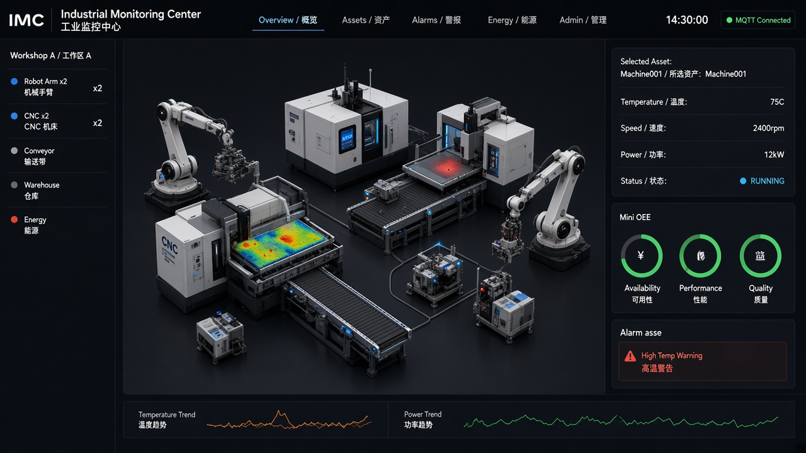
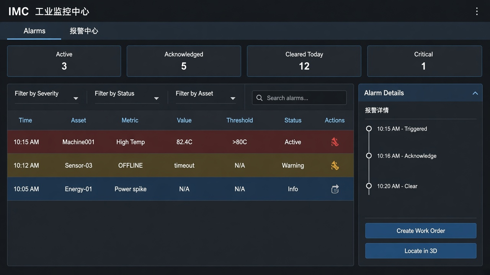
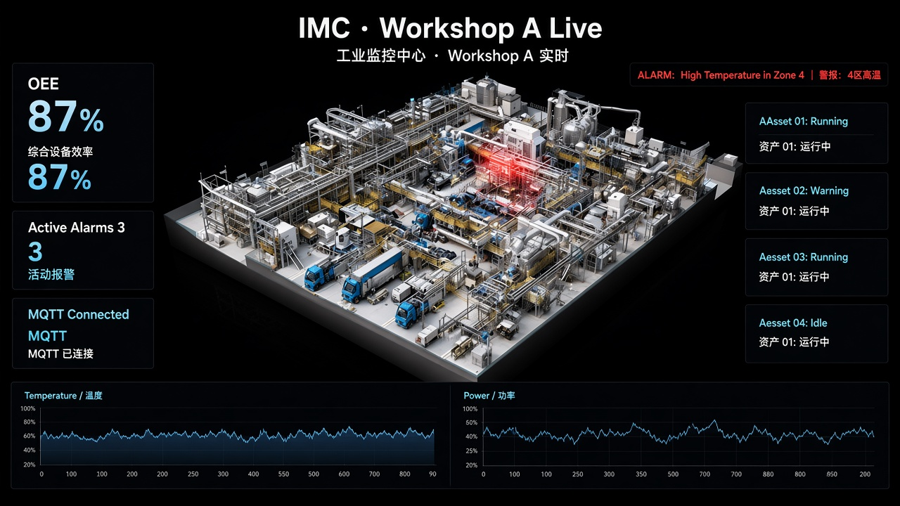

# Industrial Monitoring Center (IMC)

Single-workshop industrial monitoring digital twin:
**ingest → store → push → 3D / alarms**.

Public MVP showcase: a runnable pipeline (not a fake frontend animation) with live telemetry, alarm closed loop, history/KPI, and a 3D workshop twin.

**Start here for demos:** [docs/demo.md](docs/demo.md) (60–90s talk track) · [docs/architecture.md](docs/architecture.md)

## Language policy

- **Canonical language for this repository: English**
  (README, code comments, commit messages, CI, `docs/*.md`).
- User-facing UI copy is English-first (i18n keys may be added later).

## Current MVP data path

```
imc-simulator ──MQTT──► (embedded Aedes / Mosquitto) ──MQTT──► imc-realtime ──WS──► imc-web
```

> `imc-ingest` subscription is temporarily handled by `imc-realtime`; split later.

## 1. Requirements

- Node.js ≥ 20
- Docker (optional for local `dev:live`; required for `docker:mvp`)

## 2. Quick start (recommended showcase paths)

### A. Docker MVP (product-style demo)

```bash
cp .env.example .env
npm install
npm run docker:mvp
```

Open: http://127.0.0.1:3000  
Stack: Postgres + Timescale + Mosquitto + api + realtime + simulator + nginx web.

Stop: `npm run docker:mvp:down`

### B. Local alarm closed-loop demo

```bash
cp .env.example .env
npm install
npm run dev:live:spike
```

Open: http://127.0.0.1:3000  
Spike simulator cycles hot/cool so you can show **ACTIVE → ACKED → CLEARED** quickly.  
Vite proxies `/ws` → realtime `:3002`.

### C. Local (Node, steady drift)

```bash
cp .env.example .env
npm install
npm run dev:live
```

### D. Local with Postgres

```bash
cp .env.example .env
npm install
npm run docker:up          # Postgres + Timescale (+ Redis/Mosquitto infra)
npm run db:migrate
npm run dev:live:db        # api + realtime + simulator + web
```

You should see:

1. Login page → use **demo accounts** below (lab only)
2. Live panel with **WS open** / **MQTT live**
3. **Eight** workshop assets updating about once per second (`SIM_FLEET=all`)

### Demo accounts (lab / local only)

| User | Password | Role |
|---|---|---|
| `observer` | `observer123` | observer |
| `admin` | `admin123` | admin |
| `operator` | `operator123` | operator |

> **Not for production.** Change `JWT_SECRET`, set `IMC_ALLOW_DEFAULT_JWT=false` on any exposed host.  
> Production builds disable mock login fallback; Compose lab may still allow the default JWT via `IMC_ALLOW_DEFAULT_JWT=true`.

### Screenshots

| Preview | |
|---|---|
| Twin overview (design target) |  |
| Alarm center (design target) |  |
| Wallboard (design target) |  |

More mockups: [`docs/ui-designs/`](docs/ui-designs/).  
Live product captures: add files under [`docs/screenshots/`](docs/screenshots/), then link them here.

### Acceptance checklist

**Live pipeline**

- [ ] Temperature values change on the live panel
- [ ] Status shows `RUNNING` and occasionally `FAULT`
- [ ] Stopping the simulator stops UI updates (real pipeline, not fake frontend refresh)
- [ ] `GET http://127.0.0.1:3002/health` returns `"ok": true` (includes `openAlarms`)
- [ ] Unauthenticated `/live` redirects to `/login`
- [ ] `/assets` shows the workshop registry (8 seeded assets) and links back to Live

**Alarm closed loop**

- [ ] Start with spike/hot/power simulator (see below)
- [ ] `/alarms` shows `TEMP_HIGH` in `ACTIVE` (or `POWER_HIGH` with power mode)
- [ ] Live panel shows ACTIVE badge / red count linking to `/alarms`
- [ ] Login as `operator` → **Ack** → state becomes `ACKED` (WS must be authenticated)
- [ ] After temperature ≤ threshold → state becomes `CLEARED`
- [ ] Login as `observer` → Ack button disabled / rejected by realtime
- [ ] Stop the simulator → after offline timeout the asset goes `OFFLINE` and an `OFFLINE` alarm raises
- [ ] Restarting `realtime` hydrates open alarms from Postgres (when `DATABASE_URL` is set)

**Settings + audit**

- [ ] `/settings` shows global temperature / power / offline thresholds
- [ ] Login as `admin` → change a threshold → realtime uses the new value within ~5s
- [ ] Ack / asset / work-order actions appear in the audit table
- [ ] `npm run db:backup` writes SQL dumps under `backups/` when Compose Postgres is up

**History + Timescale**

- [ ] Live card shows a temperature sparkline that moves
- [ ] Open `/history` — 1h uses live ring; 6h/24h hits Timescale API
- [ ] `GET http://127.0.0.1:3001/history?assetId=Machine001` returns downsampled `samples`
- [ ] `GET http://127.0.0.1:3002/health` shows `"timescale": true` when configured
- [ ] Restarting `realtime` clears the ring buffer; Timescale data remains

**KPI / energy / wall / 2D**

- [ ] Open `/kpi` — workshop availability + estimated kWh + CSV export
- [ ] `GET http://127.0.0.1:3001/kpi` and `GET http://127.0.0.1:3001/energy` return Timescale aggregates
- [ ] `/twin` toggles **3D / 2D floor**; `/wall` is the shift wallboard
- [ ] `/history` Play/Pause scrubber + CSV; `/alarms` CSV export

**3D twin (R3F + glTF + heat shader)**

- [ ] Open `/twin` — Workshop A with typed glTF stand-ins (`/models/*.glb`)
- [ ] `Machine001` body color follows live temperature (green→yellow→red, 40→90°C)
- [ ] Over 80°C body pulses warmer; status lamp still blinks on FAULT
- [ ] Click a mesh → side panel updates; History / Alarms links work
- [ ] `npm run models:twin` regenerates stand-in GLBs

**Docker MVP**

- [ ] `npm run docker:mvp` builds and starts Postgres + Timescale + mosquitto + api + realtime + simulator + web
- [ ] http://127.0.0.1:3000/login works (JWT session)
- [ ] http://127.0.0.1:3001/health returns `"db": true` and `"timescale": true`
- [ ] http://127.0.0.1:3002/health returns `"postgres": true` and `"timescale": true`
- [ ] After alarm raise, row exists in `alarms`; realtime restart still shows open alarms
- [ ] Mosquitto rejects anonymous MQTT (`allow_anonymous false`); realtime/simulator use `MQTT_USER` / `MQTT_PASSWORD`
- [ ] `GET http://127.0.0.1:3002/metrics` returns Prometheus text (`imc_ws_clients`, `imc_open_alarms`)

### Alarm demo (manual script)

```bash
# Option A — cyclic hot/cool (best for raise → ack → clear)
npm run dev:live:spike

# Option B — hold over-temp
npm run dev:live:hot

# Option C — hold over-power (POWER_HIGH)
npm run dev:live:power
```

Full talk track: [docs/demo.md](docs/demo.md).

1. Open http://127.0.0.1:3000/login → `operator` / `operator123`
2. Wait until Live shows an ACTIVE badge (or open `/alarms`)
3. Confirm row: rule `TEMP_HIGH`, state `ACTIVE`, value > 80
4. Click **Ack** → `ACKED` (and `ackedBy=operator`)
5. Wait for cool phase (spike mode) or stop hot mode → `CLEARED`
6. Sign out → login `observer` / `observer123` → Ack disabled

Out of scope this milestone: MQTT TLS, HTTPS reverse proxy, HA, OPC-UA, IEC 62443. See runbook “Plant hardening”.

## 3. Separate processes

```bash
npm run dev:realtime    # :3002 WS + optional embedded MQTT :1883
npm run dev:simulator   # publishes Machine001
npm run dev:simulator:hot    # hold T=86°C (force alarm)
npm run dev:simulator:spike  # 15s hot / 20s cool cycle
npm run dev:simulator:power  # hold P=16.5 kW (POWER_HIGH)
npm run dev:live:spike       # full stack with spike cycle
npm run dev:live:power       # full stack with over-power
npm run dev:web         # :3000
```

Alarm demo env vars (optional; see `.env.example`): `SIM_FORCE_TEMP`, `SIM_FORCE_POWER`, `SIM_SPIKE`, `SIM_SPIKE_SEC`, `SIM_COOL_SEC`.

Use Compose Mosquitto instead of embedded broker:

```bash
docker compose -f deploy/docker-compose.yml --env-file .env up -d mosquitto
```

In `.env`:

```env
IMC_EMBED_MQTT=false
MQTT_URL=mqtt://127.0.0.1:1883
MQTT_USER=imc
MQTT_PASSWORD=imc_mqtt_password
```

## 4. Repository layout

```
apps/web            Login + live + assets + alarms + history + kpi + twin + wall + settings
apps/realtime       MQTT → WS bridge + TEMP/POWER/OFFLINE rules + JWT ack
apps/simulator      Workshop fleet publisher (8 assets; drift / hot / spike / power)
apps/api            Fastify REST (auth, assets, alarms, WO, history, KPI, energy, thresholds, audit)
apps/ingest         Dedicated ingest (placeholder; MVP uses realtime)
packages/shared-types   Protocol types
deploy/             Docker Compose skeleton
docs/               Project docs (architecture, protocol, runbook, demo, UI designs)
```

## 5. Protocol

See [docs/protocol.md](docs/protocol.md) and `packages/shared-types/src/index.ts`.

## 6. Documentation index

1. [docs/demo.md](docs/demo.md) — showcase talk track (start here for demos)
2. [docs/business-logic.md](docs/business-logic.md) — business flows
3. [docs/architecture.md](docs/architecture.md) · [docs/protocol.md](docs/protocol.md) · [docs/runbook.md](docs/runbook.md)
4. [docs/ui-designs/](docs/ui-designs/) — IMC UI mockups
5. [docs/screenshots/](docs/screenshots/) — live product captures (add your PNGs)

## 7. Year 1 freezes

1. Single workshop (Workshop A)
2. Frontend: React + Three.js / R3F
3. Ingest priority: MQTT
4. Browser uses first-party WebSocket — no direct MQTT from the UI
5. Each quarter must ship a runnable milestone
