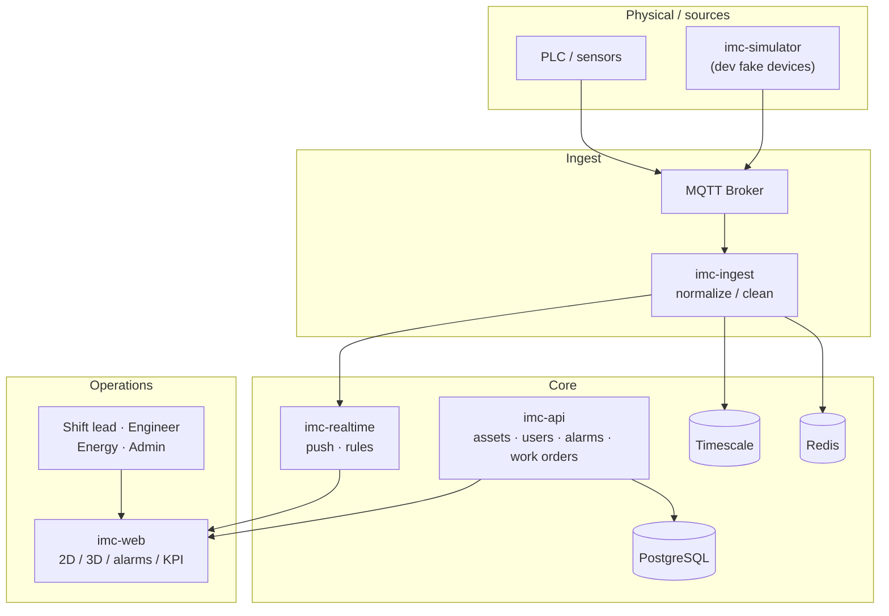

# IMC Business Logic

> Goal: explain what the system does with one overview diagram and a few flows.  
> UI targets: [ui-designs/](./ui-designs/)

---

## 1. One sentence

IMC turns real machine telemetry into a closed loop that is **observable, alarmable, traceable, and operable** — not a decorative 3D demo.

---

## 2. Target landscape (Year 1)

---

## 3. MVP vs later

| Capability | Status | Meaning |
|---|---|---|
| Fake device publishing | Done | Develop without a real PLC |
| MQTT transport | Done | Common industrial ingress |
| Backend bridge to UI | Done | Browser does not talk to the broker |
| Live temp / speed / power | Done | “Is the machine moving?” |
| Login / roles | Postgres + JWT (mock fallback) | Who can view / operate |
| Alarm closed loop | TEMP_HIGH / POWER_HIGH / OFFLINE + Postgres | Raise / ack / clear; hydrate on restart |
| History curves | Memory + Timescale | Live ~15 min; API 1h/6h/24h downsampled; 30d retention |
| 3D twin | R3F + glTF + heat shader | Pick + status lamps + temp ramp 40→90°C |
| Docker MVP | Compose profile `mvp` | Postgres + Timescale + Mosquitto + api + realtime + sim + web |
| Asset registry | Postgres CRUD (admin) | Create / update / delete; status by realtime |
| KPI / energy | Done | `/kpi` availability + `/energy` estimated kWh from avg power × hours |
| 2D floor / wallboard | Done | `/twin` 3D|2D toggle; `/wall` shift screen |
| CSV export | Done | History, alarms, KPI |
| MQTT auth | Compose | Password file; local Aedes stays anonymous |
| Work orders | Alarm → WO done | Create from alarms; Start / Done |
| Thresholds | Postgres + `/settings` | Global + per-asset; realtime reload ~5s |
| Audit | Postgres `audit_log` | Ack, assets, WO, threshold changes |

---

## 4. Core objects

### Asset

Example: `Machine001` (CNC) with type, zone, metrics, status, `updatedAt`.

### Status machine

`OFFLINE → IDLE → RUNNING → FAULT` (fault returns to IDLE; timeout → OFFLINE)

| Status | Meaning | UI target |
|---|---|---|
| RUNNING | Working | Steady blue lamp |
| IDLE | Online, not running | Gray / white |
| FAULT | Needs attention | Red blink + alarm |
| OFFLINE | Lost | Lamp off + timeout alarm |

### Telemetry payload

See [protocol.md](./protocol.md).

---

## 5. Main flows

### Live monitoring

Simulator/device → MQTT → realtime → WebSocket → operator console.

### Alarm loop

1. Simulator publishes temperature > configured `temperatureMaxC` (default 80), power > `powerMaxKw`, or goes silent.
2. `imc-realtime` raises `TEMP_HIGH` / `POWER_HIGH` / `OFFLINE` → state `ACTIVE` (no duplicate while open).
3. Web `/alarms` lists alarms; Live shows ACTIVE badge.
4. `operator` / `admin` authenticate on WS then send `alarm_ack` → `ACKED` (Ack identity is the JWT subject).
5. When the condition is gone after ack → `CLEARED`.
6. Ack / asset / work-order / threshold writes land in `audit_log`.

See [protocol.md](./protocol.md) and README acceptance checklist.

### Asset registry

Create asset → bind topics → set thresholds → assign zone → appears in console / 3D.

### History curves

**MVP:** Live ring buffer (~15 min) in realtime + **Timescale** persistence when `TIMESCALE_URL` is set. Web `/history` uses live for 1h and API downsample for 6h/24h. Retention ~7 days.

---

## 6. Module responsibilities

| Module | Responsibility |
|---|---|
| `simulator` | Pretend to be a machine; publish MQTT |
| `ingest` | Unify ingress (MVP: inside realtime) |
| `realtime` | Subscribe MQTT; evaluate TEMP/POWER/OFFLINE; push WS; verify Ack JWT |
| `api` | Login, assets, alarms REST, RBAC |
| `web` | Human UI |
| `shared-types` | Shared protocol dictionary |

---

## 7. How to use this doc

1. Read sections 1–3 before coding new features.  
2. Ask: which flow does this feature belong to? Does it change the protocol?  
3. Prefer updating this page before inventing new architecture.
