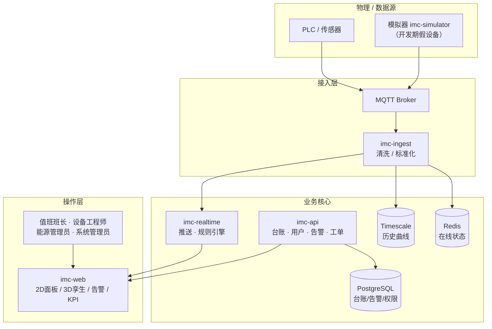
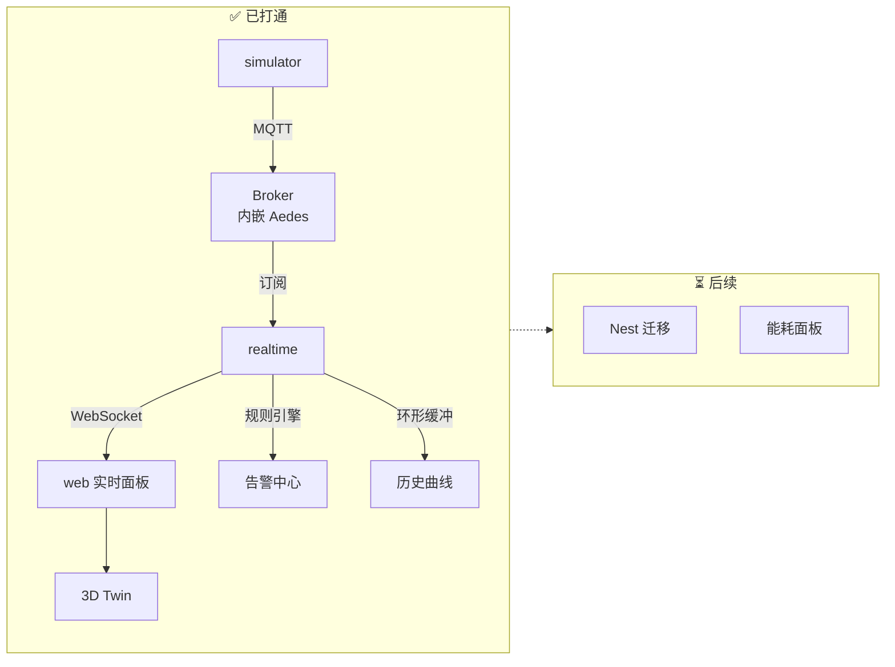
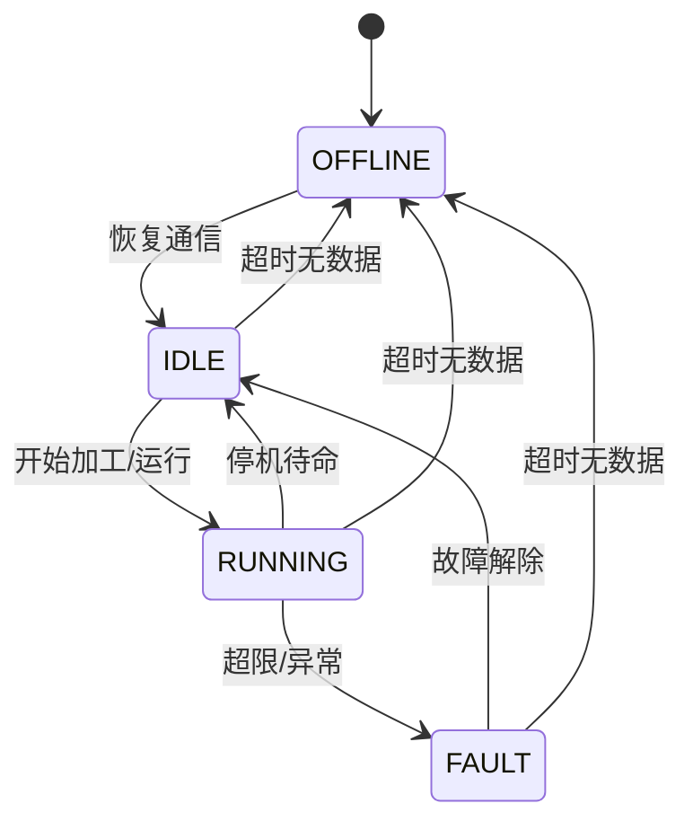
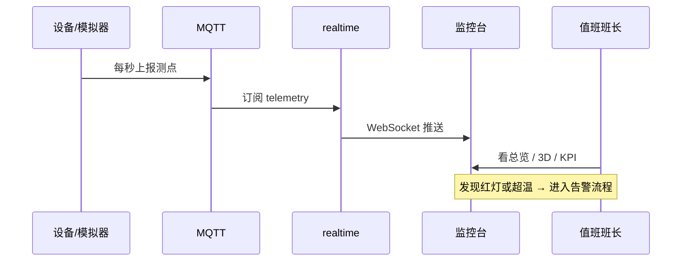
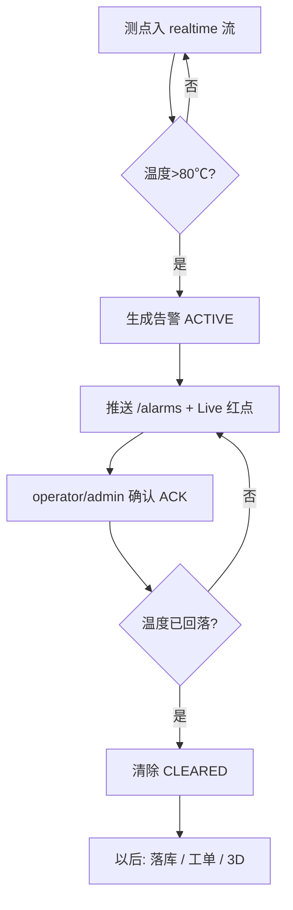
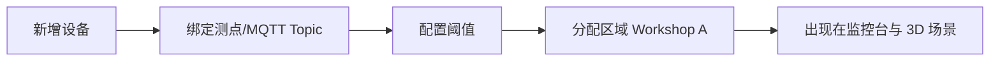

# IMC 业务逻辑说明（先捋清这一页）

> 目标：用一张总图 + 几段话，把「系统在干什么」说清楚。  
> 详细需求见 [project-plan.md](./project-plan.md)（同内容：[项目需求与规划书.md](./项目需求与规划书.md)）。  
> UI 目标态见 [ui-designs/](./ui-designs/)。

---

## 1. 一句话

IMC 做的是：**把车间设备的真实测点，变成可看、可告警、可追溯、可运维的监控闭环**。  
不是做一个会动的 3D 演示页。

---

## 2. 业务全景（目标态 Year 1）



**读图要点：**

1. 左边进来的是「事实」（温度、转速、功率、状态）  
2. 中间负责存、判、推  
3. 右边是人用来看和处置  

---

## 3. 当前已实现（MVP）vs 尚未做



| 能力 | 状态 | 对应业务含义 |
|---|---|---|
| 假设备持续上报 | ✅ | 没有真 PLC 也能开发 |
| MQTT 传输测点 | ✅ | 工业常见接入方式 |
| 后端桥接推前端 | ✅ | 浏览器不直连 Broker |
| 页面看实时温/速/功率 | ✅ | 值班「设备是否在动」 |
| 登录 / 角色 | ✅ Postgres + JWT（可回落 Mock） | 谁能看、谁能确认告警 |
| 告警闭环 | ✅ 内存 + Postgres | 超温 → 列表 → 确认 → 清除；重启可恢复 |
| 台账 | ✅ Postgres CRUD | 管理员增删改；状态由 realtime 更新 |
| 历史曲线 | ✅ 内存 + Timescale | 实时约 15 分钟；API 支持 1h/6h/24h |
| 3D 孪生 | ✅ R3F + glTF + 热力 Shader | `/twin` 温度绿→黄→红（40→90℃） |
| Docker MVP | ✅ Compose `mvp` | Postgres + Timescale + Mosquitto + api + realtime + sim + web |
| KPI / 能耗 | ✅ 可用性 KPI | `/kpi`；能耗专页后补 |
| 告警工单 | ✅ 简易闭环 | 告警一键转 WO；Start / Done |

---

## 4. 核心业务对象

### 4.1 设备（Asset）

车间里每一台可监控对象，例如 `Machine001`（CNC）。

关键字段：类型、区域、实时测点、状态、最后更新时间。

### 4.2 状态机（必须统一）



| 状态 | 业务含义 | UI 表现（目标） |
|---|---|---|
| RUNNING | 正常干活 | 蓝灯常亮 |
| IDLE | 在线但未运行 | 灰/白灯 |
| FAULT | 异常需处理 | 红灯闪 + 告警 |
| OFFLINE | 失联 | 灯灭 + 超时告警 |

### 4.3 标准测点报文（协议）

```json
{
  "assetId": "Machine001",
  "ts": 1760000000000,
  "metrics": {
    "temperature": 75.0,
    "speed": 2400,
    "power": 12.0
  },
  "status": "RUNNING"
}
```

**业务含义：** 全系统只认这一份「真相」；UI、告警、历史都从它派生。

---

## 5. 主业务流程（按角色怎么用）

### 5.1 实时监控（值班班长）



### 5.2 告警闭环（设备工程师）— MVP 已打通（内存版）



验收命令：`npm run dev:live:spike`，详见根目录 README「Alarm demo」。

### 5.3 设备台账（系统管理员）

已实现：`/assets` 列表 + admin CRUD（`POST/PATCH/DELETE`，Bearer `pg.*`）。  
测点绑定 / 阈值配置仍为全局默认（超温 80℃），后续再做 per-asset。



### 5.4 追溯查询（工程师 / 管理者）

- 查某设备近 24h 温度曲线  
- 查某次告警：何时触发、谁确认、何时清除  
- 查操作审计：谁改了阈值  

---

## 6. 和 UI 设计稿的对应关系

| 设计稿 | 文件 | 覆盖的业务 |
|---|---|---|
| 登录 | `ui-designs/imc-ui-01-login.png` | 身份与角色 |
| 3D 总览 | `ui-designs/imc-ui-02-twin-overview.png` | 空间监控主入口 |
| 设备详情 | `ui-designs/imc-ui-03-asset-detail.png` | 单设备测点/阈值/处置 |
| 告警中心 | `ui-designs/imc-ui-04-alarm-center.png` | 告警闭环 |
| KPI/OEE | `ui-designs/imc-ui-05-kpi-oee.png` | 可用性决策 |
| 能耗 | `ui-designs/imc-ui-06-energy.png` | 能源异常 |
| 设备台账 | `ui-designs/imc-ui-07-asset-registry.png` | 主数据管理 |
| 投屏大屏 | `ui-designs/imc-ui-08-wallboard.png` | 车间看板模式 |

---

## 7. 用「故事」串起来（建议你按这个理解）

1. 管理员先在台账里登记 `Machine001`，绑好温度/转速/功率测点，设超温 80℃。  
2. 设备（或模拟器）开始往 MQTT 发数据。  
3. 后端收到后：更新在线状态、写历史、判断要不要告警，并推到前端。  
4. 班长在总览看到蓝灯；温度升高变红/热力变红，告警列表出现一条。  
5. 工程师点选设备看曲线，确认告警，必要时开工单。  
6. 事后任何人都可按时间把这条链路查回来。  

**若第 2～3 步用前端写死假数据刷新，就不是工厂级；我们 MVP 已经按真链路做了第 2～3 步的最小版。**

---

## 8. 模块职责速查

| 模块 | 一句话职责 |
|---|---|
| `simulator` | 假装是车间设备，往 MQTT 发报 |
| `ingest` | （目标）统一接入、清洗；MVP 暂由 realtime 兼任 |
| `realtime` | 订 MQTT，向浏览器推 WS |
| `api` | （目标）登录、台账、告警 REST、权限 |
| `web` | 人机界面：现在实时面板，以后 3D/告警/KPI |
| `shared-types` | 协议与类型，全员共用一本「字典」 |

---

## 9. 你接下来怎么用这份文档

1. 先看第 2、3、7 节，确认「系统在干什么」没有歧义。  
2. 对照第 6 节设计稿，想清楚 Year 1 屏幕优先级。  
3. 开发时任何新功能先问：它落在哪条业务流？改了协议没有？  

有歧义就改这一页，而不是先改代码。
